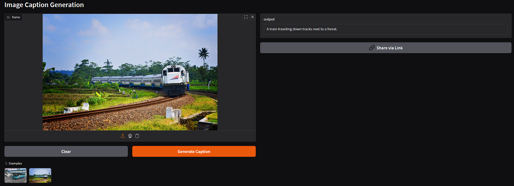

## 🖼️ Image Caption Generator using ViT and BART [Live Application](https://huggingface.co/spaces/ashish-001/ViT-BART-Based-Image-Captioning)

This project demonstrates an Image Captioning system that generates natural language descriptions for images using a **Vision Transformer (ViT)** encoder and a **BART** decoder. It is deployed using **Gradio** on Hugging Face Spaces.

---

### 🚀 Demo

👉 Try it live on [Hugging Face Spaces](https://huggingface.co/spaces/ashish-001/ViT-BART-Based-Image-Captioning)

---

### 📌 Overview

* Upload or select a sample image
* Generates relevant captions using a ViT encoder + BART decoder
* Uses a projection layer to map ViT outputs to BART's expected dimensions
* Easy-to-use Gradio web interface

---

### 🔧 Model Architecture

* **Encoder**: [`ViT-base-patch16-224`](https://huggingface.co/google/vit-base-patch16-224)
* **Decoder**: [`facebook/bart-base`](https://huggingface.co/facebook/bart-base)
* **Projection Layer**: A linear layer maps ViT's output (768) to BART's input size (768)


---

### 🧪 Evaluation

Average scores on a validation set of 3000 images:

* **BLEU-1**: 0.803
* **BLEU-2**: 0.589
* **BLEU-3**: 0.468
* **BLEU-4**: 0.401
* **METEOR**: 0.308

---

### 📦 Installation

```bash
pip install -r requirements.txt
```

---

### ▶️ Run Locally

```bash
python app.py
```

---

### 🌐 Deployment

To deploy on [Hugging Face Spaces](https://huggingface.co/spaces):

1. Create a new Space
2. Select **Gradio** as the SDK
3. Upload your `app.py`, `model_architecture.py`, `image_captioning_model_state_dict.pt`, `requirements.txt`, and `example images`

---

### 🧱 File Structure

```
├── app.py                              # Gradio app interface
├── model_architecture.py              # Model definition using ViT + BART
├── image_captioning_model_state_dict.pt  # Trained model weights
├── image_caption.ipynb                # Jupyter notebook for training
├── requirements.txt                   # Required Python libraries
├── Image.jpg                          # Example image for user input
├── Image2.jpg                         # Another example image
├── Screenshot1.png                    # Screenshot of the Gradio app
├── Screenshot2.png                    # Additional screenshot
└── README.md


```


---
### 📸 Screenshots




---
📷 Example Images Source

[Image Link](https://farm9.staticflickr.com/8258/8630907793_09759ba602_z.jpg)

[Image 2 Link](https://farm6.staticflickr.com/5450/8976673239_a621e6f59e_z.jpg)